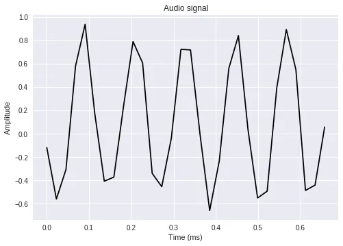
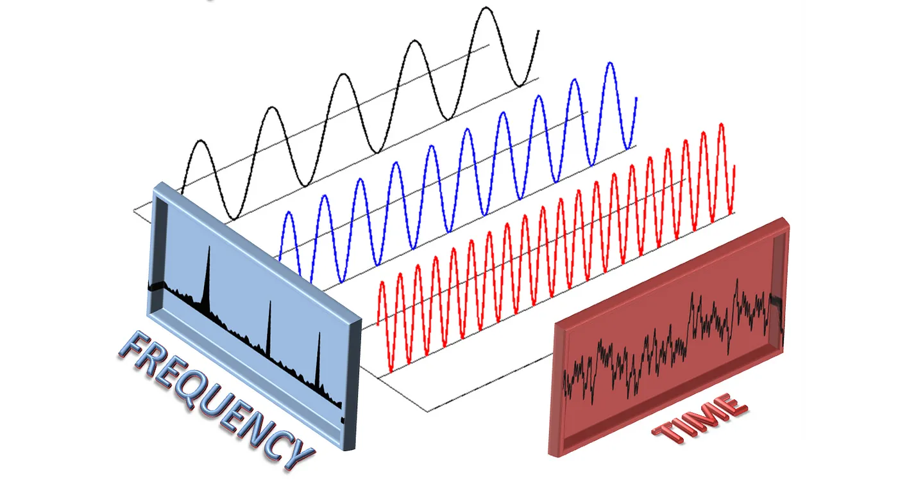
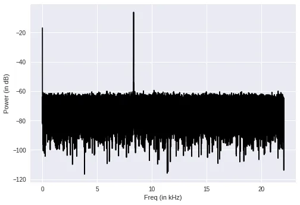
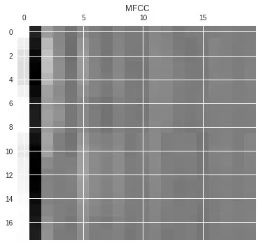

# POC - Speech Recognition

## A - Audio analysis

### How audio data works ?

The sampling frequency, also known as the sample rate, refers to the number of samples per second in a sound.

In audio files, the standard sampling frequency is 44100 samples per second.

#### 1 - Reading audio file

Audio files are commonly handled as wave files(*"audio.wav"*).

When reading an audio file, we obtain information such as the sampling frequency, which represents the number of samples per second, along with the actual audio data.

#### 2 - Audio Signal

By utilizing the audio signal, we can visualize the amplitude.

#### 3 - Fourier Transform

The Fourier Transform is a tool that decomposes a waveform (a function or signal) into an alternative representation using sine and cosine functions. It demonstrates that any waveform can be expressed as the sum of sinusoidal functions.

The Fourier Transform is a powerful tool that helps us understand and analyze waveforms.

Fast Fourier Transform (FFT) is a method that changes a sequence of complex numbers from one form to another.

When we use FFT, it gives us complex values with Real and Imaginary parts, but we can also think of them as magnitude and phase.

In the case of audio, we often care more about the magnitude because it relates to what we hear.

To understand the strength of the signal, we convert FFT values into decibels and plot how the frequency relates to the power of the signal.

#### 4 - MEL-Frequency Cepstral Coefficients (MFCC)

The Mel scale helps us hear pitch changes better at low frequencies than at high frequencies.

Now, think of two tools (Discrete Cosine Transforms *"DCTs"* and Discrete Fourier Transform *"DFT"*) as wizards for understanding sounds. *DCT* uses only one kind of wave (cosine), while *DFT* uses two (cosine and sine). They follow different rules because they work in different ways to break down sounds.

The *librosa* package allows to easily extract MFCC features.

In summary, MFCCs are an effective method for extracting discriminative features from audio signals, focusing on the perceptual aspects of sound.

## B - Hidden Markov Models (HMM)

### What is HMM ?

A Hidden Markov Model (HMM) is a statistical model that describes how something evolves over time.

This model is particularly useful for representing hidden states, such as phonemes and/or words, making it an instrumental choice for our Speech Recognition system.

In speech recognition, phonemes (basic sounds) serve as states, and audio frames are represented using MFCCs. The goal is to identify the sequence of phonemes from a series of MFCCs, representing the audio. With the phonemes, a phoneme-to-word dictionary helps decipher the spoken words. Gaussian Mixture Models (GMMs) are employed to calculate the likelihood of MFCC observations given a particular state.

#### 1 - How train a GaussianHMM Model ?

We'll create multiple GaussianHMM models, each for a distinct category. During testing, the audio file will be processed by these models, generating scores. The label from the model with the highest score will be assigned, considering we've trained multiple GaussianHMM models.

After that, we'll go through each file, extracting the label for each recording from the parent file.

In each file with multiple recordings, we utilize the majority for training and reserve one for testing. As we iterate through each wave file, we extract MFCC features, focusing on the initial set for each file.

After extracting MFCC features from each file, we train the HMMTrainer by initializing the class. This process is repeated for all files.

#### 2 - Test of the Model

To test our model, we select multiple *".wav"* files for evaluation.

By extracting MFCC features for each test file, we obtain scores for each label. By selecting the label with the maximum score for each test file, we make our final prediction.

**Source: [https://maharshi-yeluri.medium.com/understanding-and-implementing-speech-recognition-using-hmm-6a4e7666de1](https://maharshi-yeluri.medium.com/understanding-and-implementing-speech-recognition-using-hmm-6a4e7666de1)**
